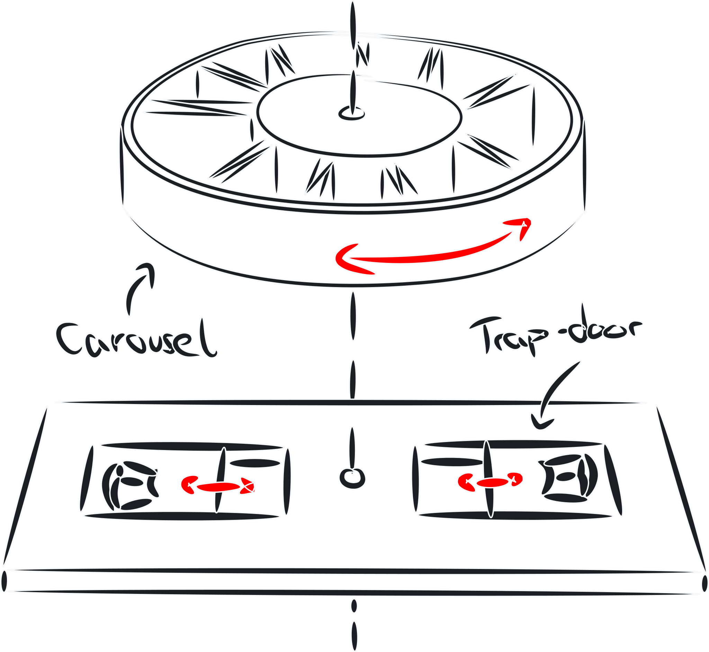
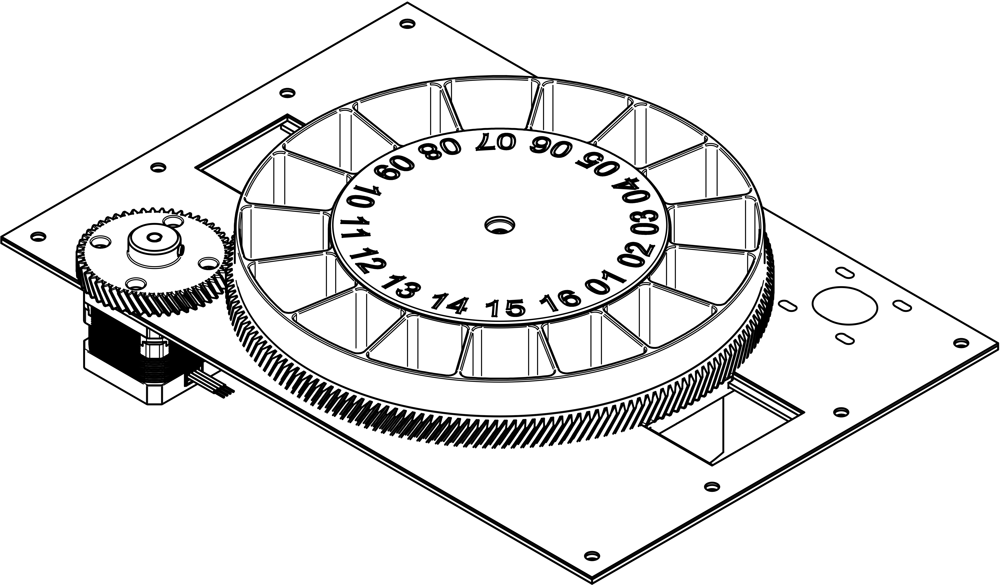
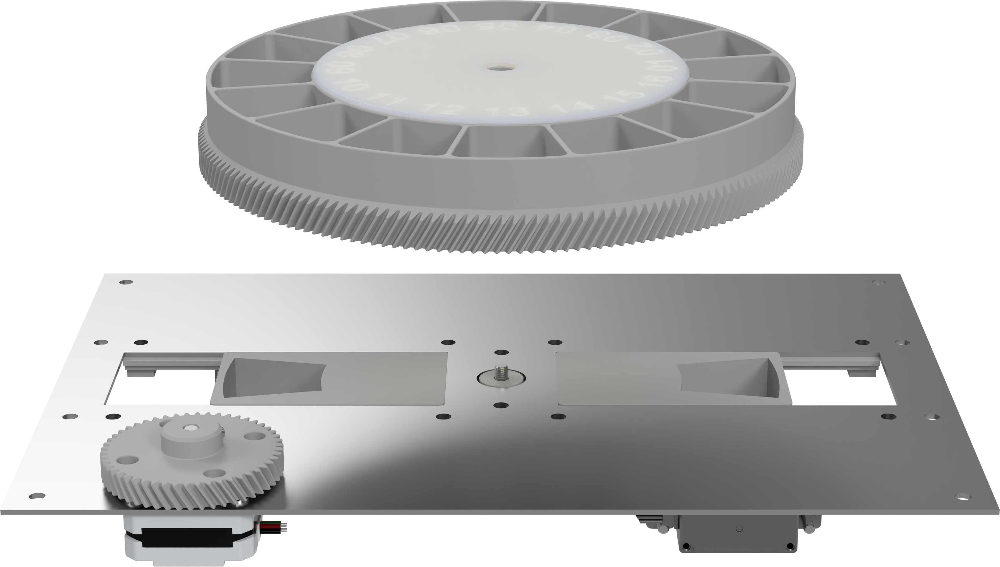
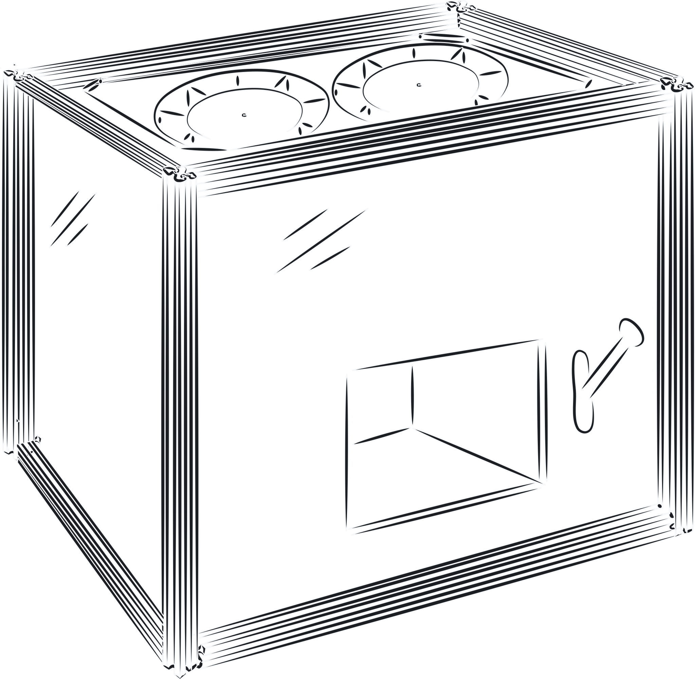
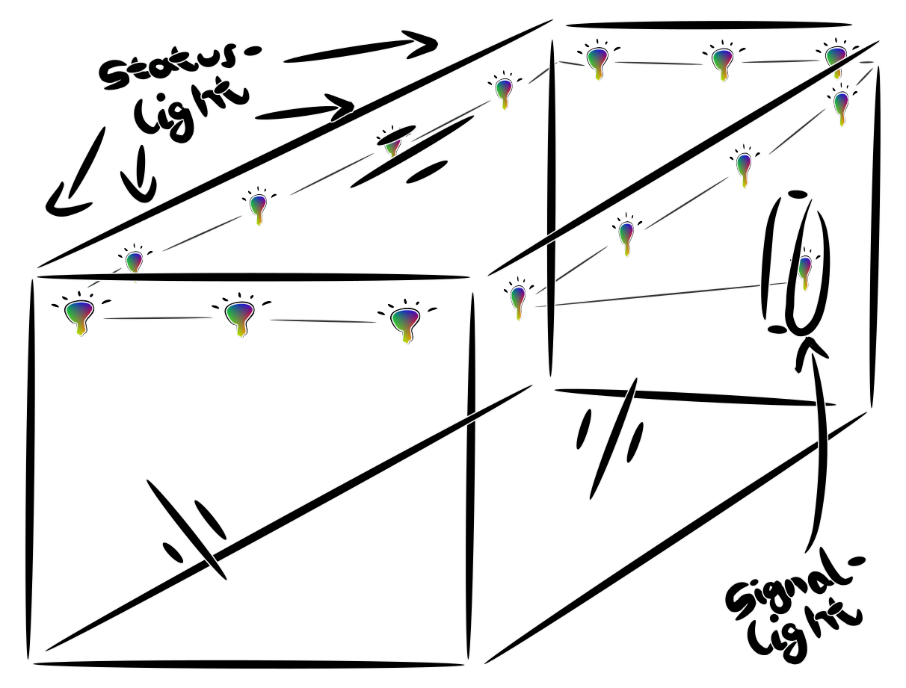
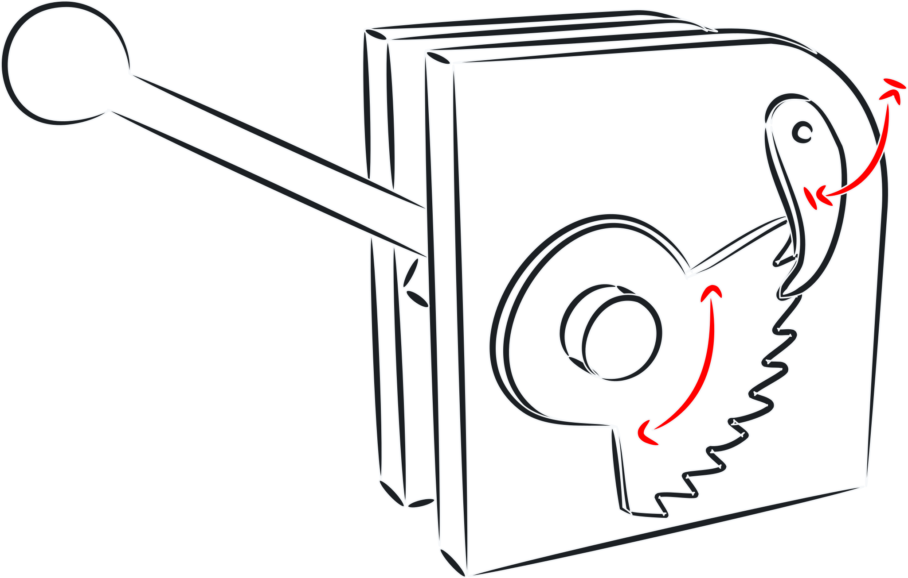
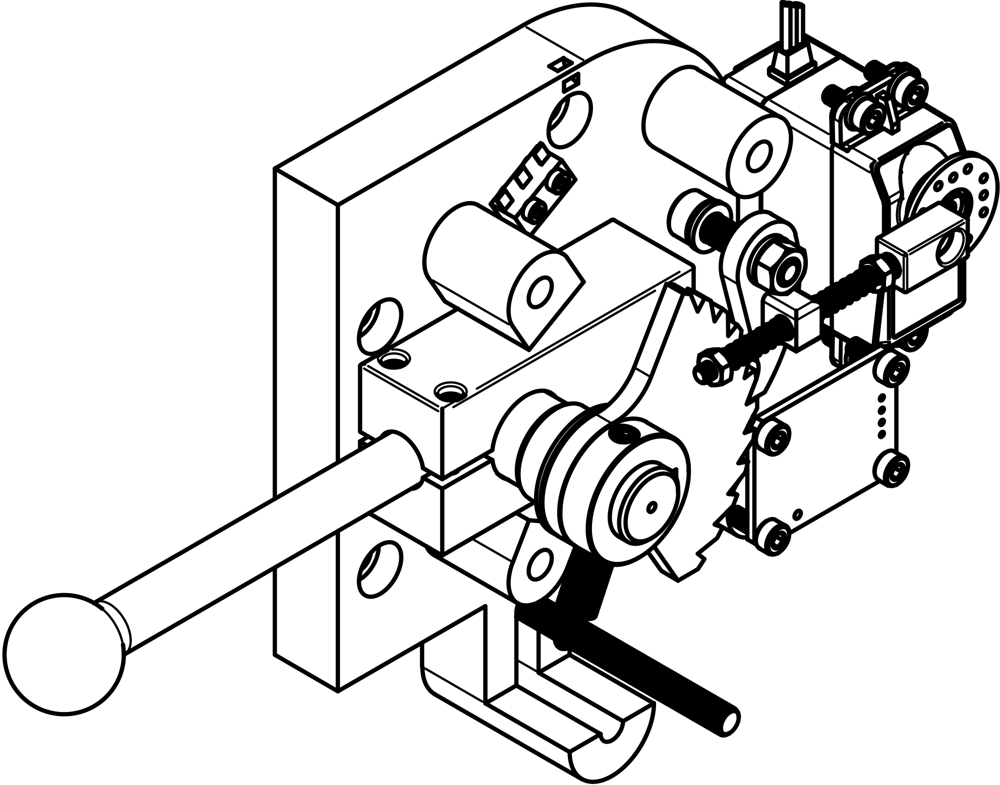
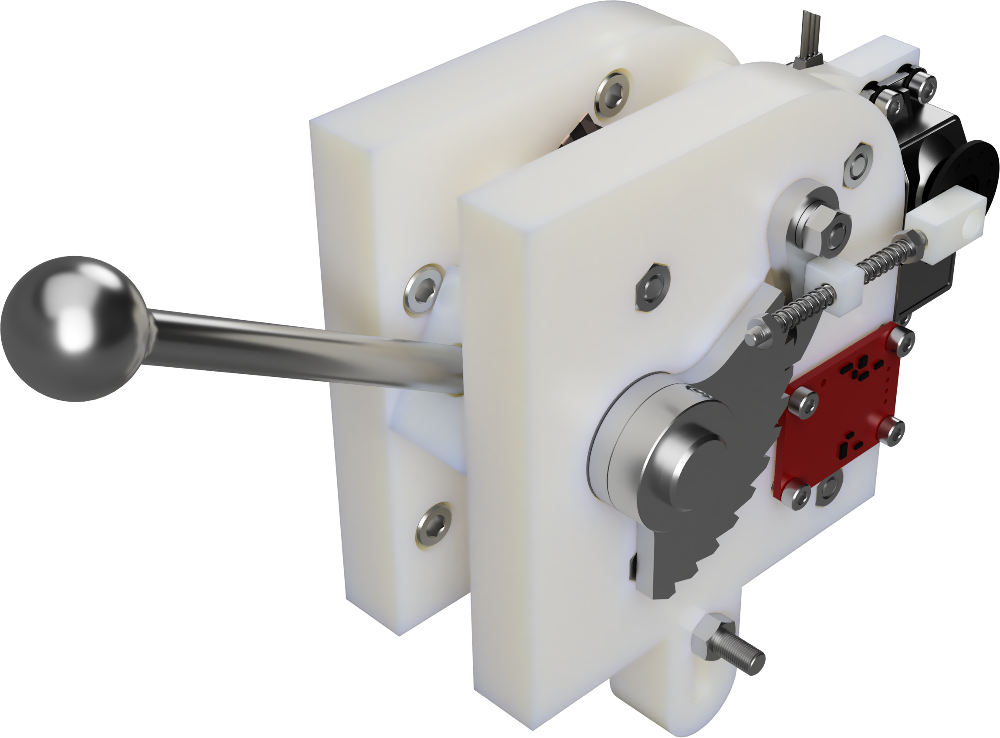
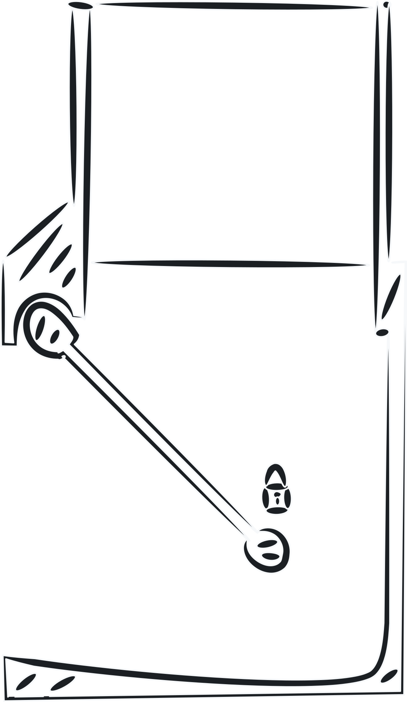
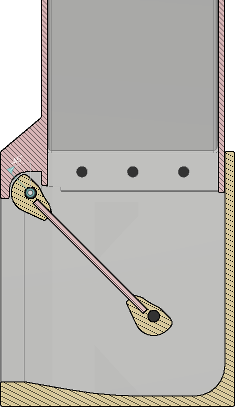

# Hardware concept

## Carousel

The carousel is the component that is responsible for the reward distribution. Mechanically, the carousel is driven by a stepper motor that is connected to the carousel assembly via a gear train with a ratio of 18:5. This allows the motor to achieve an accuracy of 0.5° without microstepping when rotating the carousel, as calculated in [Table 1](#table_1). In addition, the carousel is equipped with an absolute magnetic encoder which allows it to determine the current absolute position of the carousel at any time after a one-time calibration. The encoder is located on the underside of the carrier plate and is mounted according to the data sheet of the AS5048A which is used in this application. Except for the mount plate, the carousel consists of only 3D-printed parts and is designed for production using the FDM printing process.

*Figure 1: Concept*

| Steps-Rotation                | Carousel |
| ----------------------------- | -------- |
| Compartments per Rotation     | 16       |
| Angle per Compartment         | 22,5°    |
| Gear Carousel Teeth           | 180      |
| Gear Stepper Teeth            | 50       |
| Stepper Angle per Compartment | 81°      |
| Stepper StepAngle             | 1,8°     |
| Steps per Compartment         | 45       |

*Table 1: Steps and rotational calculations of the square*

*Figure 2: Final Drawing*

*Figure 3: Final Render*

## Frame

The main structure of the apparatuses is constructed out of aluminum extrusions, which allows for changes to the structure later on and are very easy to assemble. Additionally, they are very durable, which is a big advantage for a portable piece of hardware like this, as it can support the panels, allowing for weight savings on the paneling and even allows the apparatus to survive drops with ease.

*Figure 4: Frame*

## Lights

The illumination of the apparatuses is done by LED strips. A addressable lighting system based on addressable LEDs. Examples of the individual LED components are WS2812B, SK9822 and APA102C. These LED components are commonly sold as LED strips by the meter, which are suitable for use directly behind a diffuser, like the outer wall of the apparatuses, as shown in [Figure 5](#figure_5). In this concept, the signal light can be controlled virtually via the status light. For this purpose, a part of the status light LED strips is placed in a delimited area on the inside of the diffuser near the lever and switched on and off independently of the rest of the strip. The color of the signal light can also be changed afterwards.

*Figure 5: Lights*

## Lever

The lever is, as can be seen in [Figure 7](#figure_7), the mechanically most complex individual component of the apparatuses. It has a motorized locking system that prevents the lever from moving downward. It also has three sensors that detect touch, the states of the lever being fully pulled or fully up position. In addition, large parts of the lever are made of metal to withstand the mechanical stresses that occur when the lever is pulled by the subjects. These include the lever rod, the joint axis, and the parts of the locking device: ratchet wheel and pawl. In addition, a spring located in the lower part of the assembly ensures that the lever returns to the fully up position when no force is applied. Unfortunately, the lever is the most difficult to manufacture, as due to the high mechanical and environmental stress of the components, they have to be machined or cut out of stainless steel.

*Figure 6: Lever concept*

*Figure 7: Open lever*

*Figure 8: Render lever*

*Figure 9: Render lever in the apparatus*

## Hopper

The most important aspect when delivering rewards is the safety of the test subjects. For this reason, special care was taken in the design to ensure that the test subjects could not reach into the mechanical parts of the device. [Figure 10](#figure_10) shows the conceptual cross-section of the reward slide the test subjects interact with. The smallest distance between the walls is chosen so that a standard grape with an estimated maximum diameter of up to 20 mm can still fit through, but due to the chosen path that the reward must take through the chute, it is made as difficult as possible to reach around it. The 20 mm grape is an upper size estimate that was chosen to take into account most of the possible reward types available to the researchers.

*Figure 10: Concept of a monkey proof reward chute*

*Figure 11: Section analysis of the final design*
